# Next Features

Version 0.1 uses a velocity entered by the operator. Version 0.2 should estimate that velocity from a short river video and show enough evidence for the operator to accept or reject the result.

## Version 0.2 objective

The next release will add camera-based surface-velocity estimation. It will not send messages or change alert status without operator approval.

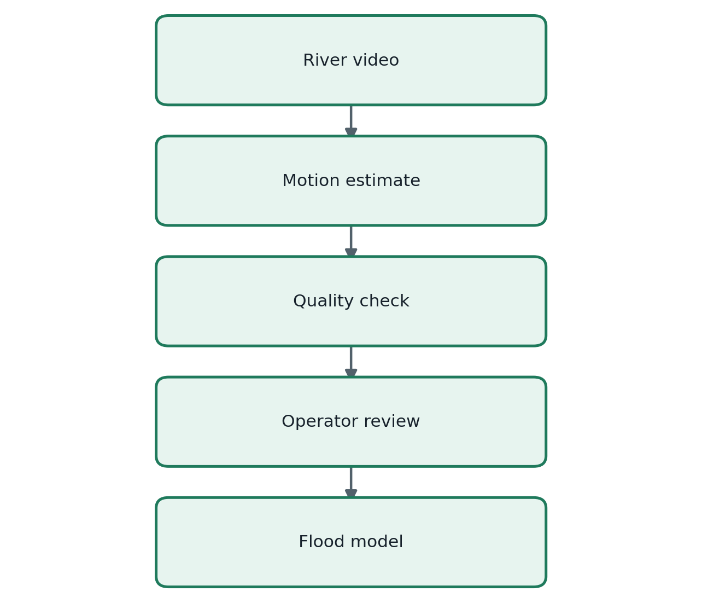

The first implementation should support one camera, one selected river region, and one physical calibration reference. That is enough to test the complete measurement path without hiding uncertainty behind a large interface.

## Measurement workflow

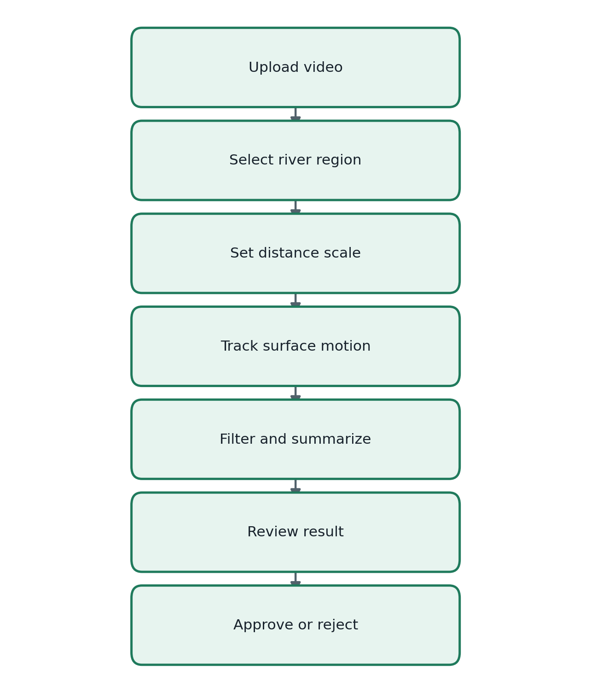

1. Upload an MP4 file or choose the demonstration clip.
2. Mark the region where the water surface is visible.
3. Enter a known length in the image to convert pixels to metres.
4. Sample frames at known time intervals.
5. Estimate motion with optical flow.
6. Reject vectors that are inconsistent, stationary, or outside the river region.
7. Calculate the median velocity and its spread.
8. Show the vectors, time series, calibration, and quality score.
9. Let the operator approve or reject the estimate.

## Velocity calculation

For a tracked displacement of **Δp** pixels, image scale **s** metres per pixel, and frame interval **Δt** seconds, the surface-velocity estimate is:

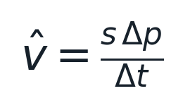

For **n** valid motion vectors, use a robust central estimate:

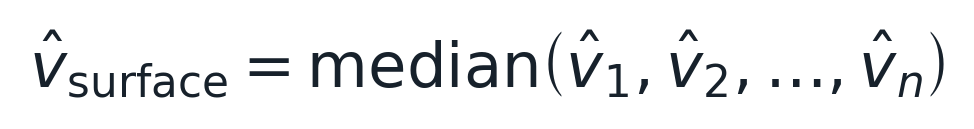

A simple relative spread can be reported using the median absolute deviation:

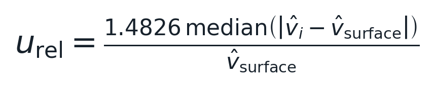

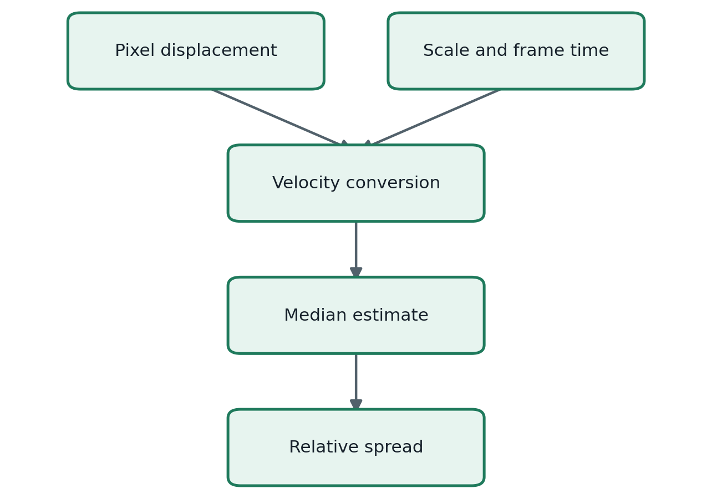

The equations describe image-surface motion. Converting this value to depth-averaged river velocity requires a calibrated correction factor and field measurements; that conversion is outside the first camera prototype.

## Code changes

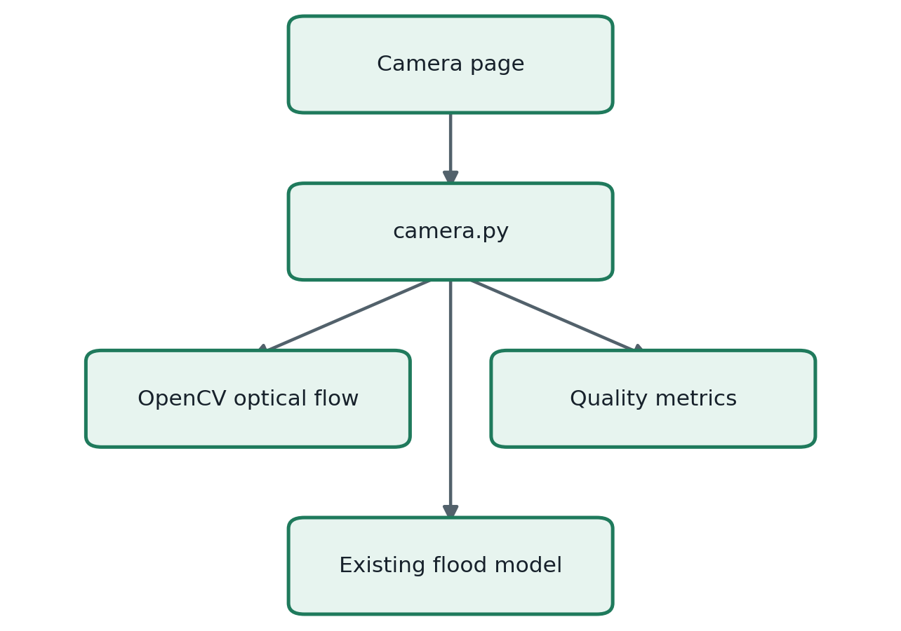

| Change | Purpose |
|---|---|
| Add optional OpenCV dependency | Read video and calculate optical flow |
| Create `src/nepal_flood_warning/camera.py` | Keep image processing outside the routing model |
| Add a Camera Analysis page | Select the region, calibration, and frame range |
| Add vector filtering | Remove weak and contradictory motion estimates |
| Add quality metrics | Report valid-vector count, spread, and calibration state |
| Add a synthetic fixture | Test motion against a known displacement |
| Add camera tests | Check conversion, repeatability, rejection, and failure cases |

## Acceptance tests

The release is ready only when each decision point below has an automated or documented test.

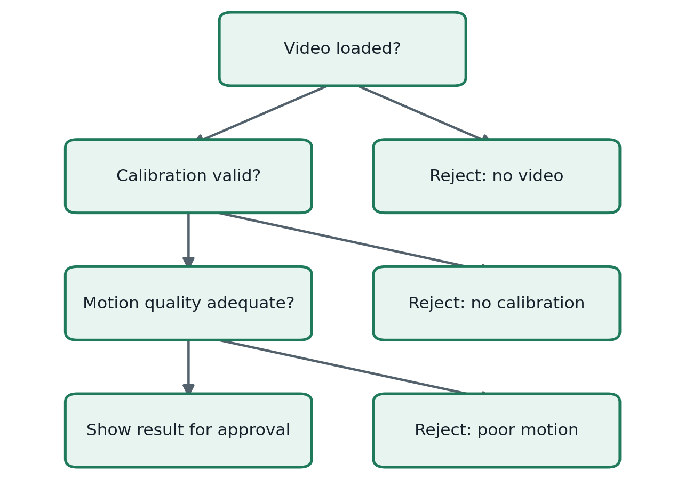

- A fixed demonstration video gives a repeatable estimate.
- Synthetic motion is recovered within a stated tolerance.
- The app refuses metre-per-second output when physical calibration is missing.
- Low valid-vector count or high spread causes rejection, not a confident value.
- The page shows the video, selected region, motion vectors, velocity series, and quality result.
- The estimate enters the routing model only after operator approval.
- No camera result sends an SMS or evacuation instruction.

## Later releases

### Version 0.3: uncertainty-aware arrival time

Replace the single arrival time with a distribution or interval derived from uncertainty in velocity, attenuation, calibration, and delay.

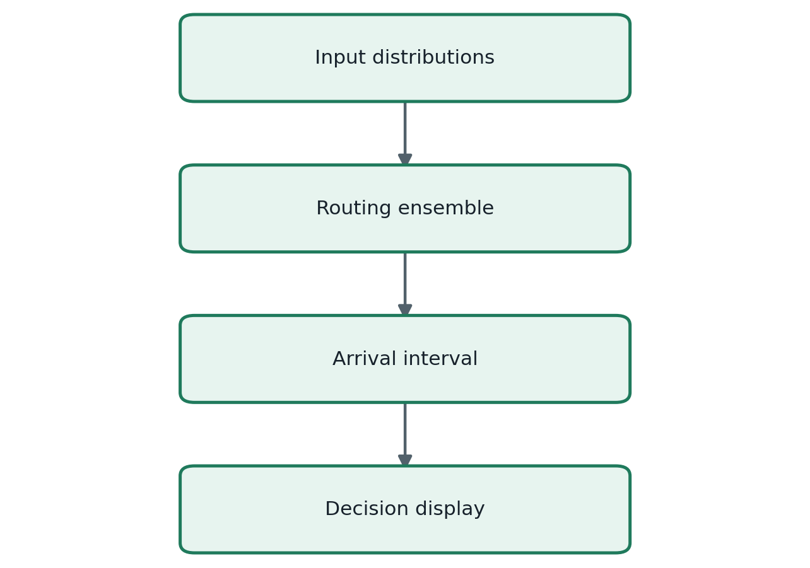

Report an early bound, median estimate, and late bound. Do not present uncertain minutes as a single exact forecast.

### Version 0.4: historical calibration

Fit the routing parameters to past observations from cameras, gauges, and known event arrival times.

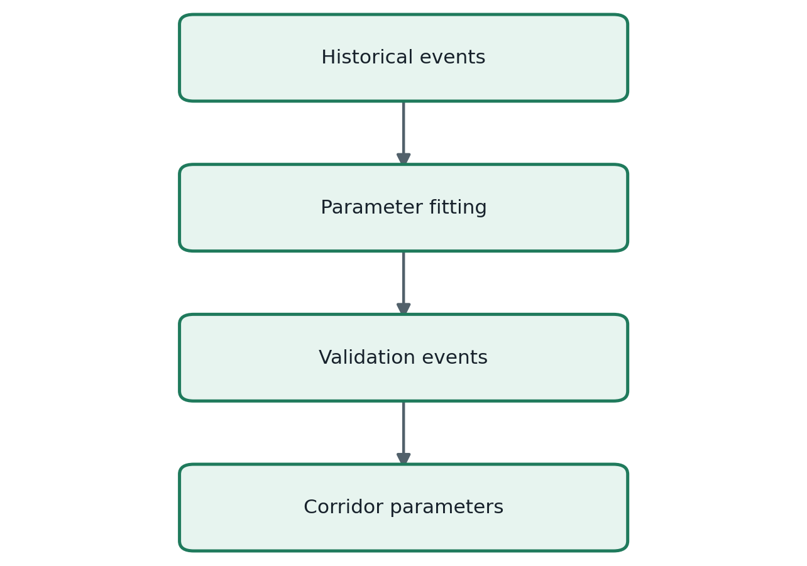

Keep calibration events separate from validation events so that reported accuracy is not based on the data used to fit the model.

### Version 0.5: sensor fusion and river network

Move from one corridor table to a directed river graph. Each node can represent a sensor, settlement, bridge, hydropower asset, or confluence.

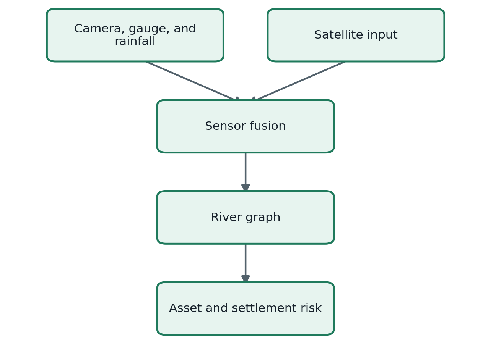

Every input should carry a timestamp, quality flag, communication state, and confidence value.

### Version 0.6: scenario playback and alert sandbox

Add historical and synthetic event playback for training. Warning messages remain drafts until an authorized operator approves a future operational connection.

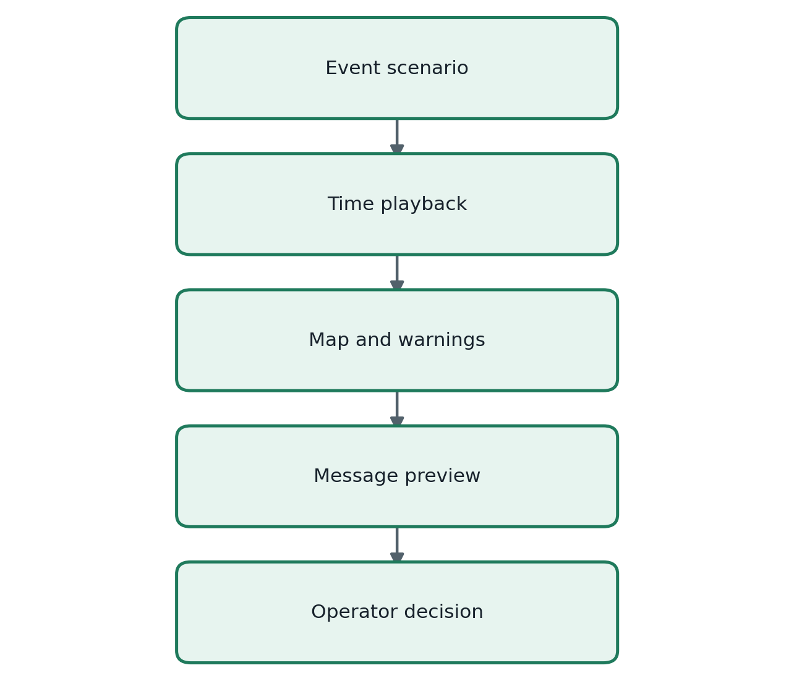

The reliability view should show stale data, camera visibility, communication delay, battery state, missing sites, and estimated delivery failures.

## Release sequence

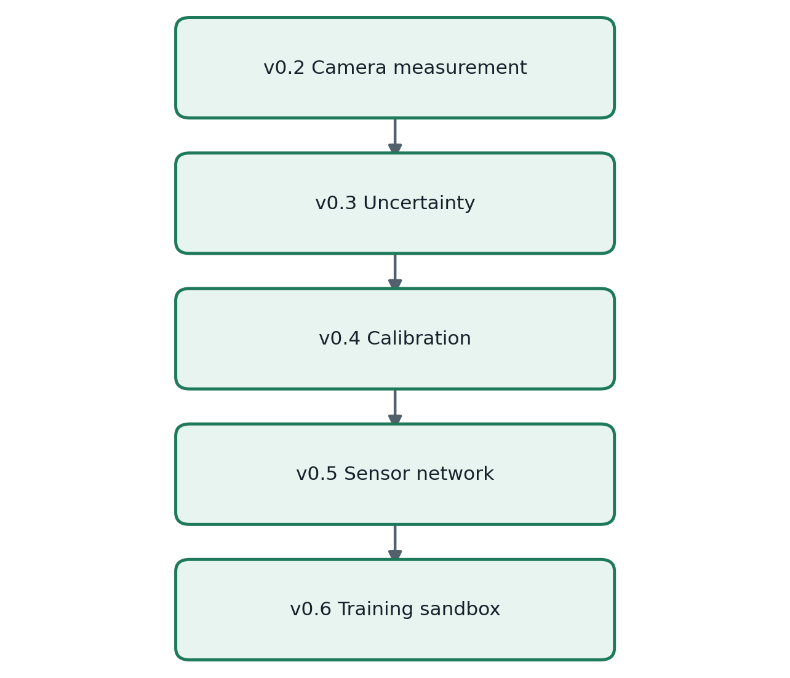

| Release | Deliverable | Evidence required |
|---|---|---|
| `v0.2` | Video-to-velocity estimate | Synthetic test and quality report |
| `v0.3` | Arrival-time interval | Sensitivity and coverage tests |
| `v0.4` | Fitted corridor parameters | Separate calibration and validation events |
| `v0.5` | Multi-sensor river graph | Timestamp and failure tests |
| `v0.6` | Playback and message sandbox | Operator-control and audit checks |

## Immediate milestone

Start with one short demonstration video and one synthetic motion test.

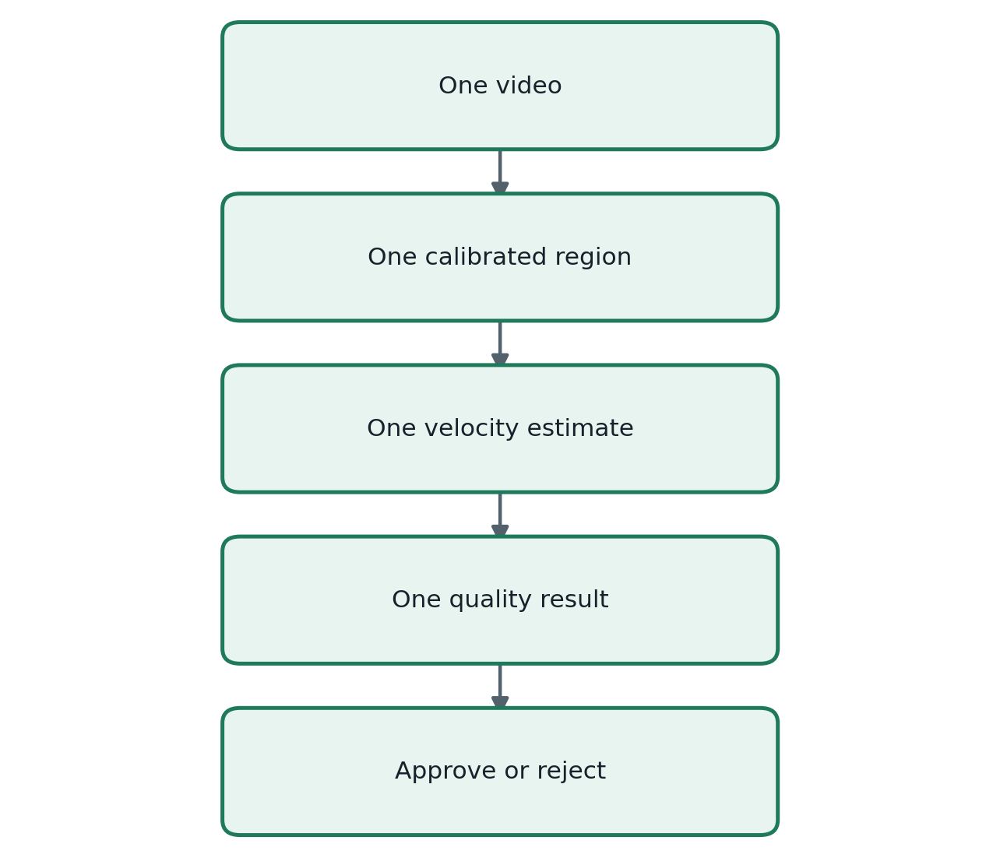

The milestone is complete when the application can reproduce a known synthetic velocity, reject an uncalibrated clip, and pass an approved measurement to the existing simulation without triggering any external alert.
