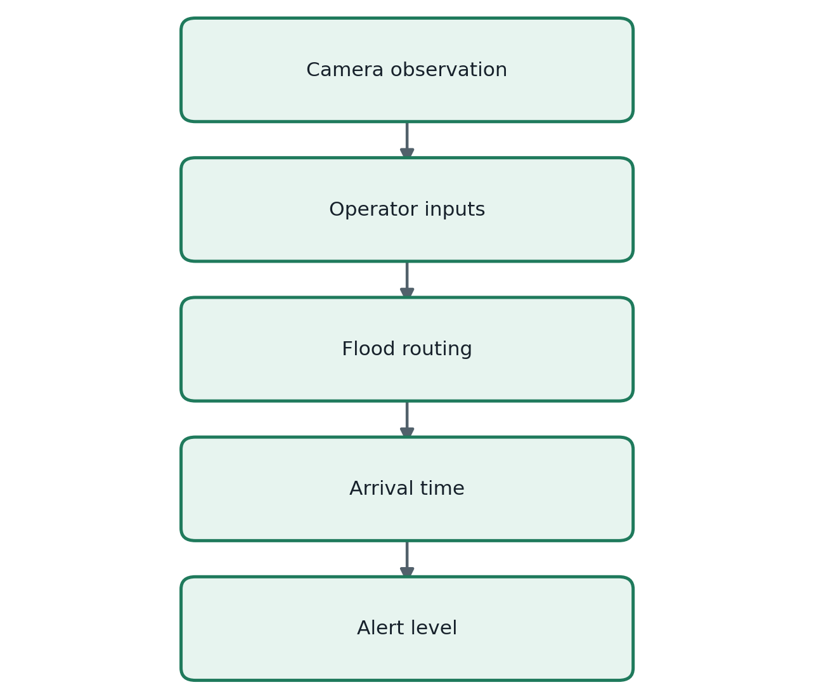
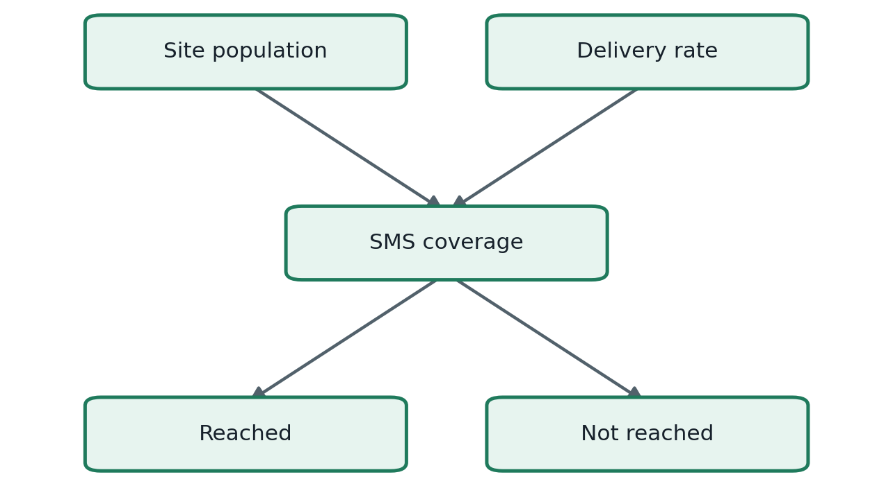
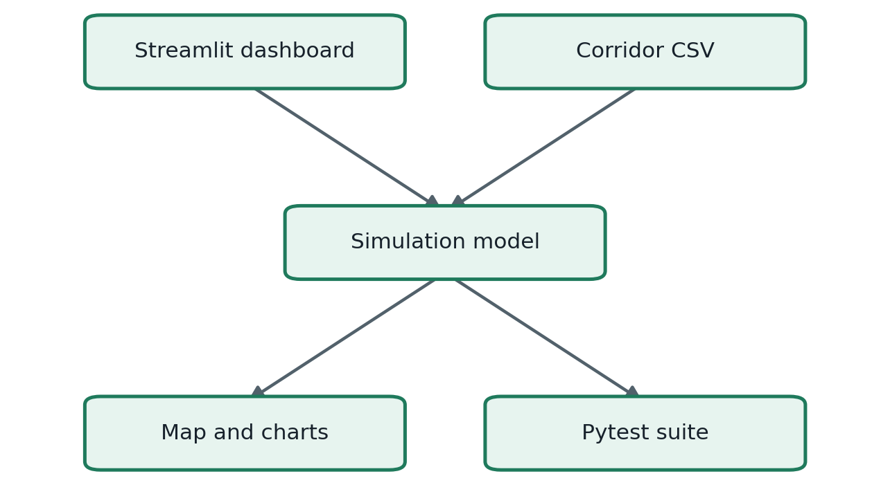
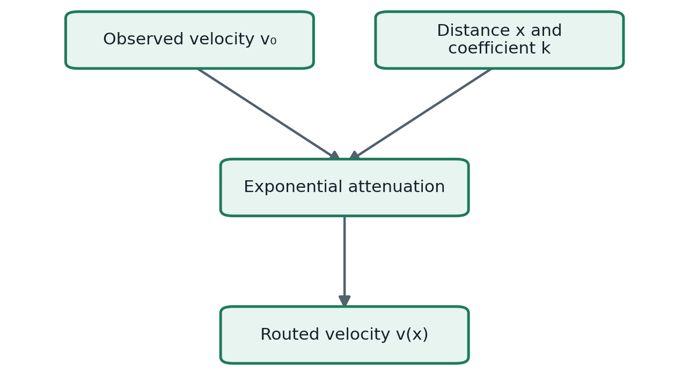
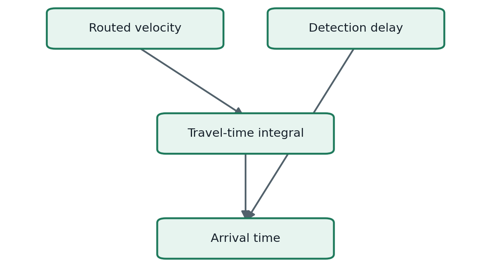
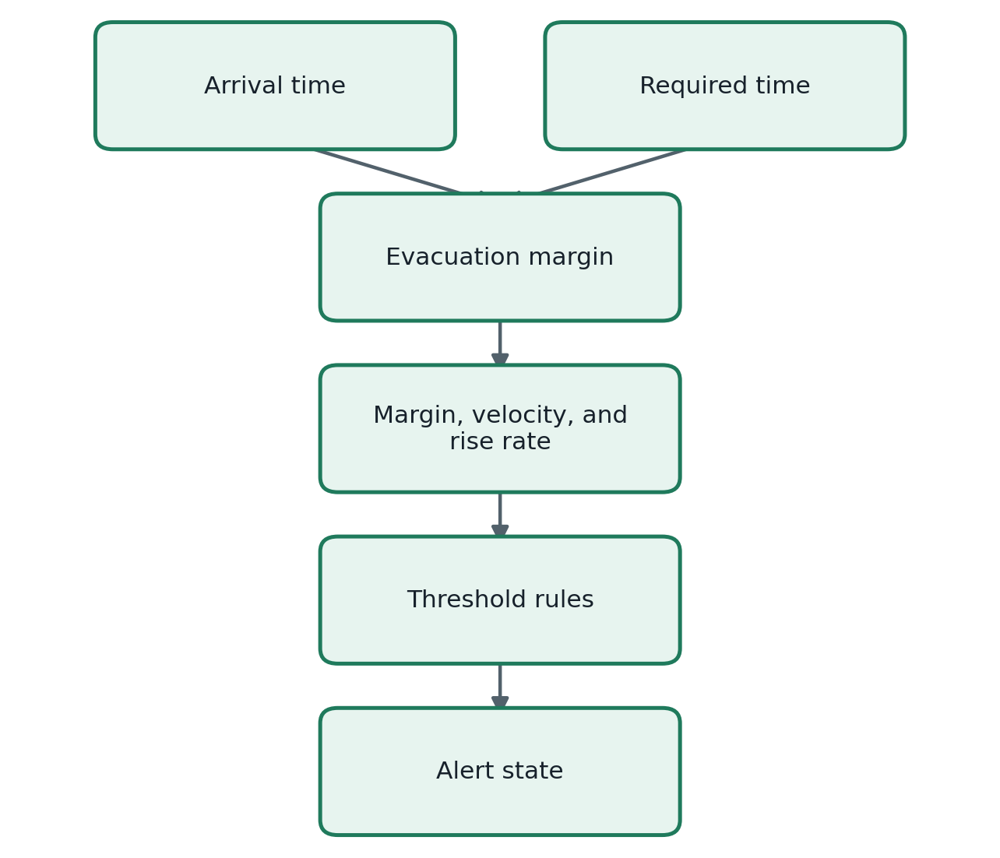
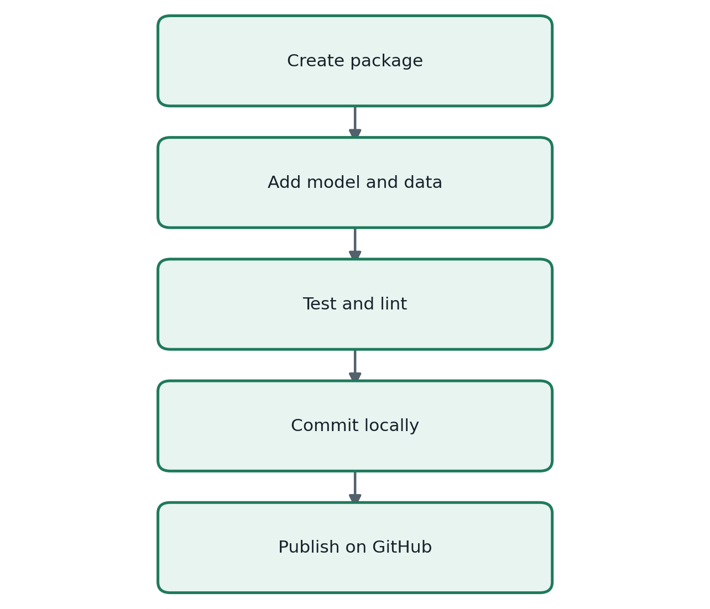
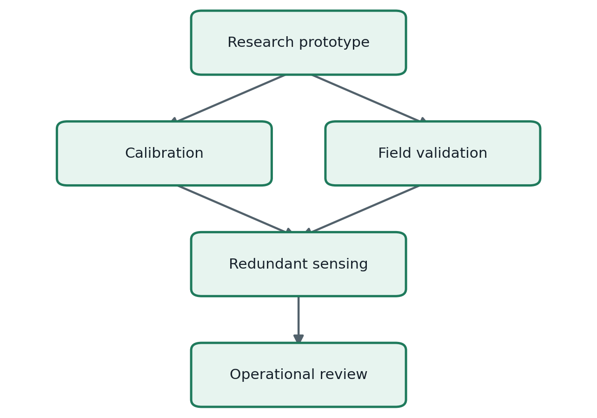

# Project Build Log

## Project

**Nepal Flood Early-Warning Simulator**  
Repository: <https://github.com/pandeysudan1/nepal-flood-warning>

This file records the scope, structure, equations, checks, and publication of version 0.1.

## What version 0.1 does

Version 0.1 models a flood signal moving from Rasuwagadhi toward Bidur along the Trishuli corridor. An operator enters the surface velocity measured at a camera, the water-level rise rate, and the expected evacuation time. The model estimates when the signal reaches each settlement and assigns an alert level.

The dashboard also compares the population at each site with an assumed SMS delivery rate. It reports both the estimated number reached and the number not reached.

## Software structure

The calculation code is separate from the dashboard. This keeps the model testable without starting Streamlit.

| Path | Purpose |
|---|---|
| `app/dashboard.py` | Controls, map, charts, metrics, and results table |
| `src/nepal_flood_warning/model.py` | Travel time, evacuation margin, alert rules, and SMS coverage |
| `src/nepal_flood_warning/__init__.py` | Public package interface |
| `data/trishuli_corridor.csv` | Demonstration sites, chainage, coordinates, and population |
| `tests/test_model.py` | Unit tests for routing and input validation |
| `pyproject.toml` | Package metadata, dependencies, and tool settings |
| `README.md` | Installation, use, assumptions, roadmap, and safety notice |

## Mathematical model

### Downstream velocity

The model assumes exponential attenuation of the observed surface velocity:

where:

- **v(x)** is the routed velocity at chainage **x**, in metres per second;
- **v₀** is the camera observation, in metres per second;
- **x** is downstream distance, in kilometres;
- **k** is the attenuation coefficient, in inverse kilometres.

### Travel time

Travel time follows from integrating **1/v(x)** along the river. Because distance is entered in kilometres and velocity in metres per second, the equation includes a factor of **1000**:

For zero attenuation, the implementation uses the limiting case:

Both results are in seconds. The dashboard converts them to minutes and adds the detection delay:

### Evacuation margin and alert level

The evacuation margin is the time left after allowing for the required evacuation period:

A negative margin means the assumed evacuation time is longer than the available warning time. Version 0.1 combines this margin with routed velocity and observed water-level rise rate. The result is one of four states: **Normal**, **Watch**, **Warning**, or **Evacuate**.

### SMS coverage

For a site with population **N** and assumed delivery rate **pSMS**:

This is a coverage estimate, not confirmation that a person read or acted on a message.

## Build and publication record

The work was completed in four stages.

1. Created the package, dashboard, dataset, tests, README, `.gitignore`, and MIT licence.
2. Ran the four unit tests; all passed.
3. Ran Ruff; no lint errors remained.
4. Committed the project locally.
5. Created the public repository under `pandeysudan1` and verified its file structure.

## Operational boundary

Version 0.1 is a calculation and training prototype. It is not an emergency-warning system.

Operational use would require measured hydrology, uncertainty bounds, sensor-failure handling, reliable communications, authorized human decisions, documented procedures, and agreement with the responsible Nepal authorities.
