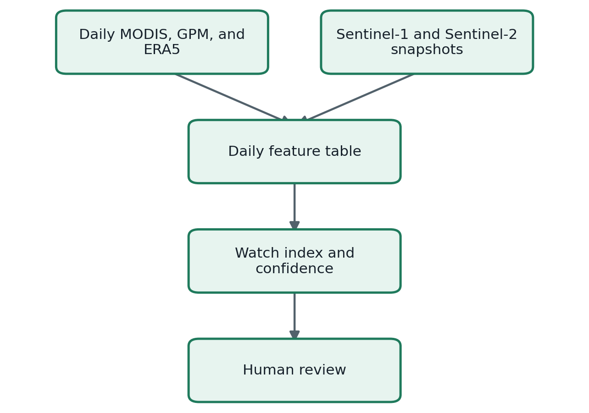
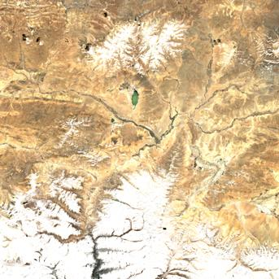
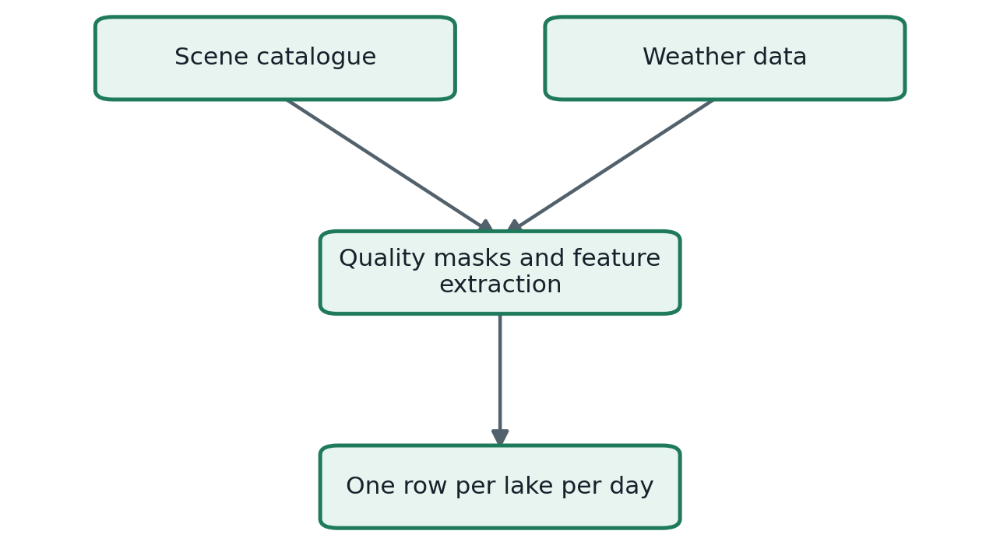
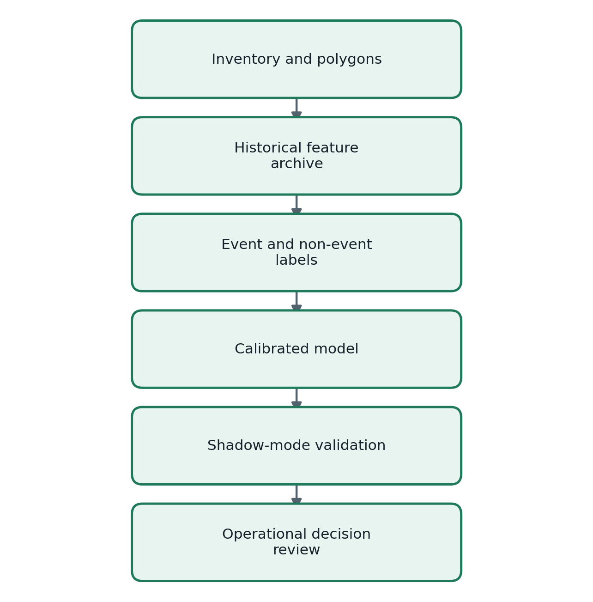

# Satellite Glacier-Lake Monitoring and GLOF Prediction Plan

## Objective

Build one daily record for every monitored glacial lake, detect unusual change, and estimate whether the lake needs expert review. The first output is a **watch index**, not an automatic flood warning.

Detailed glacier-lake geometry cannot be measured reliably every day from one satellite. Optical images are blocked by cloud and mountain shadow, while high-resolution satellites do not pass over every lake daily. The practical system uses daily coarse products for weather, snow, and temperature, then updates lake geometry whenever a clear optical or radar scene arrives.



## Example satellite scene

The repository includes an official Copernicus Sentinel-2 catalogue result for the Imja demonstration region. The selected Level-2A scene was acquired on **11 April 2026**, with **0.35% tile cloud cover** reported by the catalogue.



Scene ID: `S2C_MSIL2A_20260411T044701_N0512_R076_T45RWM_20260411T093709`

This is a catalogue thumbnail of the full satellite tile, not a cropped lake measurement. The processing pipeline must use the lake polygon to crop the source bands before calculating water area, snow cover, or change.

## Data sources

| Source | Resolution and cadence | Use in this project |
|---|---|---|
| Sentinel-2 Level-2A | 10 m surface reflectance; intermittent | Lake boundary, water index, snow line, visible change |
| Sentinel-1 GRD | All-weather radar; intermittent | Cloud-independent surface-change and lake-extent evidence |
| MODIS Terra and Aqua snow | 500 m; daily | Basin snow fraction and short-term snow loss |
| MODIS land-surface temperature | 1 km; daily | Melt-condition indicator |
| GPM IMERG | 0.1 degree; half-hourly | 24-hour and 72-hour precipitation accumulation |
| ERA5-Land | About 9 km; hourly | Temperature, freezing state, snowmelt, and runoff context |
| Copernicus GLO-30 DEM | 30 m; static | Elevation, slope, flow path, lake surroundings |
| ICIMOD glacial-lake inventory | Lake polygons and hazard attributes; static | Monitoring targets, baseline geometry, and static hazard |
| GLIMS or RGI | Glacier polygons; periodic | Associated glacier geometry and catchment context |

Official references:

- [Copernicus Data Space STAC catalogue](https://documentation.dataspace.copernicus.eu/APIs/STAC.html)
- [Sentinel-2 Level-2A collection](https://stac.dataspace.copernicus.eu/v1/collections/sentinel-2-l2a)
- [Sentinel-1 GRD collection](https://stac.dataspace.copernicus.eu/v1/collections/sentinel-1-grd)
- [MODIS Terra daily snow product](https://developers.google.com/earth-engine/datasets/catalog/MODIS_061_MOD10A1)
- [MODIS Aqua daily snow product](https://developers.google.com/earth-engine/datasets/catalog/MODIS_061_MYD10A1)
- [NASA GPM IMERG](https://gpm.nasa.gov/data/imerg)
- [ERA5-Land hourly data](https://cds.climate.copernicus.eu/datasets/reanalysis-era5-land)
- [Copernicus GLO-30 DEM](https://developers.google.com/earth-engine/datasets/catalog/COPERNICUS_DEM_GLO30_2024_1)
- [ICIMOD potentially dangerous glacial lakes](https://rds.icimod.org/metadata/799aab42-e816-4e7d-87bb-8b2147eb6a1a)
- [ICIMOD glacial-lake inventory](https://rds.icimod.org/metadata/777e6cb6-c2db-47ab-852c-48bd0f24a158)
- [GLIMS Glacier Database](https://nsidc.org/data/glims)

## What must be collected each day

The pipeline stores one row per lake per UTC day.



| Feature | Meaning | Expected source |
|---|---|---|
| `lake_area_km2` | Latest valid mapped water area | Sentinel-2 or Sentinel-1 |
| `lake_area_growth_7d_pct` | Change from seven days earlier | Derived from lake-area history |
| `lake_area_growth_30d_pct` | Change from 30 days earlier | Derived from lake-area history |
| `snow_fraction` | Snow-covered fraction of the upstream basin | MODIS Terra and Aqua |
| `snow_fraction_change_7d` | Seven-day snow gain or loss | Derived from MODIS history |
| `surface_temperature_c` | Daily land-surface temperature | MODIS |
| `positive_degree_days_7d` | Seven-day melt-energy proxy | MODIS or ERA5-Land |
| `precipitation_24h_mm` | Previous 24-hour precipitation | GPM IMERG |
| `precipitation_72h_mm` | Previous 72-hour precipitation | GPM IMERG |
| `sar_change_db` | Radar-backscatter anomaly | Sentinel-1 |
| `cloud_fraction` | Optical obstruction over the target | Sentinel-2 quality layer |
| `optical_age_days` | Age of the last accepted optical measurement | Derived |
| `sar_age_days` | Age of the last accepted radar measurement | Derived |
| `missing_fraction` | Fraction of required fields unavailable | Derived |

Every value must retain its source scene, acquisition time, processing version, quality mask, and code version. Without provenance, a daily number cannot be audited after an alert.

## Image processing

### Sentinel-2

1. Query Level-2A scenes intersecting the lake polygon.
2. Reject cloud, cirrus, cloud shadow, saturated pixels, and deep terrain shadow.
3. Calculate the Normalized Difference Water Index from green and near-infrared bands.
4. Compare the water mask with the validated lake polygon and neighbouring terrain.
5. Apply minimum-area and temporal-consistency checks.
6. Store lake area only when the usable-pixel fraction exceeds the agreed threshold.

### Sentinel-1

1. Use GRD scenes with consistent orbit direction, polarization, and geometry.
2. Apply orbit correction, noise removal, radiometric calibration, speckle filtering, and terrain correction.
3. Compare radar backscatter with a seasonal baseline.
4. Treat radar-derived lake area as a separate measurement until it has been calibrated against clear Sentinel-2 scenes.

### MODIS, GPM, and ERA5-Land

Aggregate these products over the lake catchment, not only the lake point. Record the number of valid pixels and the spatial coverage of every daily statistic.

## Prediction method

### Phase 1: transparent watch index

The repository now contains `screen_daily_risk()`. It combines lake growth, precipitation, melt energy, snow loss, radar change, and static hazard into a 0–100 screening score. Missing or stale observations reduce confidence.

The thresholds are placeholders. The score is useful for testing the data path and dashboard; it is not a GLOF probability and must not trigger public alerts.

### Phase 2: calibrated event model

After building a historical archive, define a clear target such as:

> Did a documented GLOF occur at this lake within the next 1, 3, or 7 days?

Create event windows from the ICIMOD High Mountain Asia GLOF database and match them with non-event windows from the same lakes and seasons. Train a discrete-time hazard model or a carefully regularized tree model. Split training and testing by event, lake, and year so neighbouring days from one event do not leak into both sets.

Report event recall, false alarms per lake-year, warning lead time, calibration error, and performance under missing data. Overall accuracy is not useful because GLOFs are rare.

## Development sequence



### Stage 1 — target inventory

- Obtain ICIMOD lake polygons and hazard ranks under the stated CC BY 4.0 terms.
- Select 5–10 pilot lakes rather than every glacier in Nepal.
- Verify every polygon, lake name, basin, outlet, and downstream exposure.
- Delineate the upstream catchment with GLO-30 and inspect flow paths manually.

### Stage 2 — historical archive

- Process at least 5–10 years of Sentinel, MODIS, GPM, and ERA5-Land data.
- Keep raw scene identifiers and processing logs.
- Produce one versioned Parquet table per lake per day.
- Review seasonal biases, monsoon cloud gaps, frozen lakes, and terrain shadow.

### Stage 3 — baseline and labels

- Establish seasonal baselines for water area, radar backscatter, snow, and temperature.
- Link documented GLOF dates and uncertainty windows.
- Mark data outages separately from normal conditions.
- Have a glaciologist review event and non-event samples.

### Stage 4 — model and validation

- Begin with the transparent watch index.
- Train a calibrated model only after the archive and labels pass review.
- Back-test by lake and year.
- Run in shadow mode for one full melt and monsoon season.
- Compare every raised watch with expert interpretation and field information.

### Stage 5 — connection to flood routing

Only after validation should a lake watch create a flood-routing scenario. Estimated breach volume and hydrograph must come from a separate dam-breach model with uncertainty bounds. The existing river-arrival dashboard can then display scenario ranges downstream.

## Twelve-week pilot

| Weeks | Deliverable |
|---|---|
| 1–2 | Obtain ICIMOD polygons, select pilot lakes, and verify catchments |
| 3–4 | Build Sentinel-1 and Sentinel-2 scene catalogue and quality masks |
| 5–6 | Extract MODIS, GPM, and ERA5-Land daily catchment features |
| 7–8 | Create the historical daily feature table and quality dashboard |
| 9 | Implement seasonal baselines and the transparent watch index |
| 10 | Add event labels and evaluation protocol |
| 11 | Back-test and review false alarms with a domain expert |
| 12 | Publish the pilot dashboard and shadow-mode operating procedure |

## What is implemented now

- Public Copernicus STAC query builder.
- Sentinel scene-catalogue parser.
- Scene-finder command-line script.
- Preview-image downloader.
- Imja demonstration ROI and sample scene catalogue.
- One official Sentinel-2 preview image.
- Daily feature schema and interpretable watch index.
- Tests for catalogue queries, parsing, scoring, and confidence.

Run the scene finder:

```bash
python scripts/find_satellite_scenes.py \
  --bbox 86.85 27.85 87.00 28.00 \
  --start 2026-04-01 \
  --end 2026-04-30 \
  --output data/imja_april_2026.csv
```

The example bounding box is for software testing. Replace it with the validated ICIMOD lake polygon before interpreting any result.

## Safety and governance

- Never infer safety from a missing or cloudy observation.
- Never treat a tile-level cloud percentage as lake-level visibility.
- Never train and test on adjacent days from the same GLOF.
- Never convert the watch index directly into an SMS alert.
- Preserve human authorization and an audit trail.
- Coordinate any operational warning with Nepal's responsible authorities and downstream communities.

